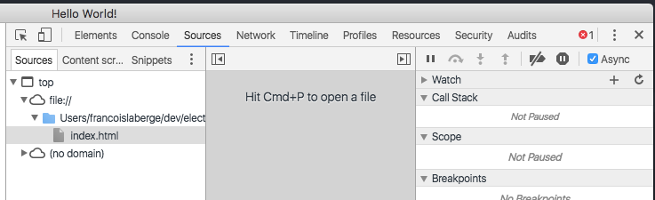
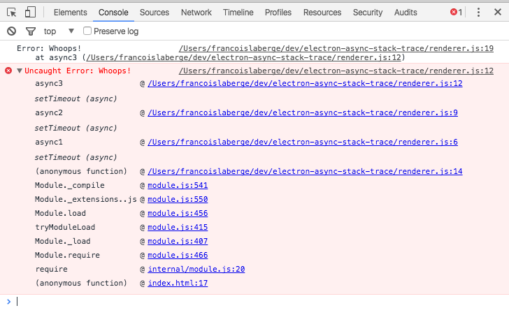

# Electron Async Stack Trace
A test suite for figuring out how to log (not capture in devtools) async stack traces

## Usage

 1. Clone / Install Dependencies

		git clone git@github.com:francoislaberge/electron-async-stack-trace.git
		cd electron-async-stack-trace
		npm install

 2. Make sure the Async Flag is checked
  
     
 3. Running the application
 
		npm start
		
 4. Notice:
     - The red text created by DevTools, has full async call stack information including clickable links to the source of each function 
     - The grey text created by `console.log(error.stack)` has nothing but the last synchronous stack frame
     
     

### Research Notes
  - Electron
    - https://github.com/electron/electron/search?utf8=%E2%9C%93&q=devToolsWebContents.executeJavaScript
  - https://cs.chromium.org
    - Code that creates HTML for stack trace:
	  - https://cs.chromium.org/chromium/src/third_party/WebKit/Source/devtools/front_end/components/DOMPresentationUtils.js?q=Components.DOMPresentationUtils.buildStackTracePreviewContents&sq=package:chromium&l=224&dr=C
    - https://cs.chromium.org/search/?q=async+stack+trace&sq=package:chromium&type=cs
	- https://cs.chromium.org/chromium/src/v8/src/inspector/v8-stack-trace-impl.cc?sq=package:chromium&dr=CSs
	- https://cs.chromium.org/chromium/src/base/debug/stack_trace_unittest.cc?q=async+stack+trace&sq=package:chromium&dr=CSs&l=11
	- https://cs.chromium.org/chromium/src/base/debug/stack_trace.h?q=async+stack+trace&sq=package:chromium&dr=CSs&l=5
